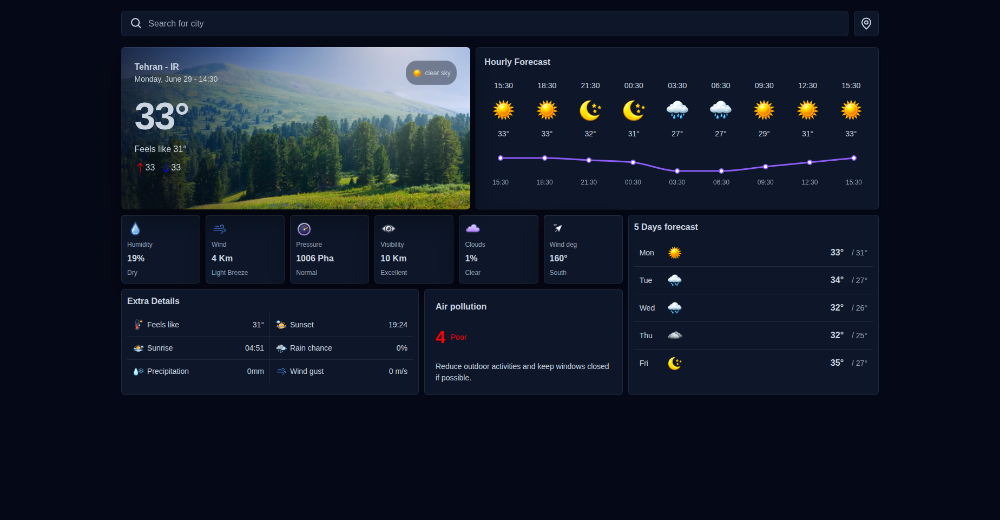

<h1 align="center">🌤️ Weatherly - Modern Weather Forecast App</h1>

<p align="center">
  <b>A modern, responsive weather application built with React, JavaScript, and OpenWeather APIs.</b><br>
  🌐 <a href="https://weatherly-app-sr.netlify.app/">Live Demo</a> •
  💾 <a href="https://github.com/SajjadR17/weather-app.git">GitHub Repository</a>
</p>

---

## 🎨 Preview

<p align="center">
  
</p>

---

# 🌦️ About The Project

Weatherly is a modern weather dashboard that provides accurate real-time weather information, hourly forecasts, 5-day forecasts, and air quality data for cities around the world.

The application focuses on delivering weather information through a clean interface with dynamic weather backgrounds, custom weather icons, and responsive layouts.

This project was built to practice real-world React development including API integration, asynchronous data fetching, reusable components, responsive design, and data visualization.

---

# ✨ Features

- 🌍 Search weather by city name
- 📍 Get weather using current location
- 🌡️ Current temperature
- 🤗 Feels like temperature
- ⏰ Live local date & time
- 🕒 Hourly weather forecast
- 📅 5-Day weather forecast
- 📈 Interactive temperature chart
- 🌅 Sunrise & Sunset
- 🌧️ Chance of rain
- 💦 Precipitation
- 🌬️ Wind speed
- 🧭 Wind direction
- 💨 Wind gust
- 💧 Humidity
- 👁️ Visibility
- ☁️ Cloud coverage
- 🌡️ Atmospheric pressure
- 🌫️ Air Quality Index (AQI)
- 💡 Weather recommendations
- 🎨 Dynamic weather backgrounds
- 🌙 Day & Night weather icons
- 📱 Fully responsive design

---

# 🌟 Highlights

- ✅ Clean and modern UI
- ✅ Responsive layout
- ✅ Dynamic weather backgrounds
- ✅ Timezone-aware local time
- ✅ Real-time weather updates
- ✅ Air Pollution integration
- ✅ Interactive charts with Recharts
- ✅ Reusable React components
- ✅ Clean and scalable folder structure

---

# 🛠️ Tech Stack

| Technology        | Usage                       |
| ----------------- | --------------------------- |
| React.js          | User Interface              |
| JavaScript (ES6+) | Application Logic           |
| CSS3              | Styling & Responsive Design |
| Axios             | API Requests                |
| OpenWeather API   | Weather Data                |
| TimeZoneDB API    | Timezone Conversion         |
| Recharts          | Temperature Charts          |
| React Icons       | Icons                       |

---

# 📦 APIs Used

- OpenWeather Current Weather API
- OpenWeather 5-Day / 3-Hour Forecast API
- OpenWeather Air Pollution API
- TimeZoneDB API

---

# 🚀 Live Demo

🔗 https://weatherly-app-sr.netlify.app/

---

# 💻 Installation

```bash
git clone https://github.com/SajjadR17/weather-app.git

cd weather-app

npm install

npm run dev
```

---

# 📂 Project Structure

```text
src
│
├── assets/
├── components/
├── services/
├── styles/
├── utils/
├── App.jsx
└── main.jsx
```

---

## 📄 License

All Rights Reserved.

This source code may not be copied, modified, distributed, or used for commercial purposes without explicit permission from the author.

© 2026 Sajjad Roohandeh

---

<h3 align="center">
Made with ❤️ by <b>Sajjad Roohandeh</b>
</h3>
